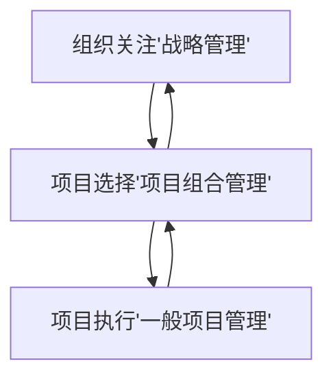

## 项目管理

通过学习项目经理，我们能够了解项目的运作和项目管理的重要性，学会学习正确的事，得到正确的结果。

> 当今社会，一切都是项目，一切也将成为项目！ ----美国项目管理协会保罗
>
> 项目管理将站到21世纪管理舞台的中央，21世纪将进入项目管理时代！----管理学大师TomPeters
>
> 在应付全球化的市场活动中，有两个管理将起到关键性的作用。第一个管理是战略管理（核心竞争力管理），第二个管理是项目管理。战略管理立足于企业的长远和宏观，它考虑的是一个企业核心的竞争力问题，而项目管理是实现这个公司战略，并且支撑这个公司快速健康发展的主要手段和重要保障。----美国学者戴维克兰德
>
> **从公司角度来说项目管理就是战略执行力，从个人来说项目管理是一套严谨的做事逻辑。** 

### 一、项目及项目管理定义

`项目`是为创造``独特性``产品、服务或成果而进行的``临时性``工作。项目的``临时性``是指`项目有明确的起点和终点`。当此项目已经完成，或项目无法完成而终止时，项目就结束了。项目的`临时性`并不代表时间短，可能是几个月甚至几年。项目虽然是临时性的，但最终`目的是为了创造持久性的结果`。

项目：创立一个公司（目的是创立一个持久的公司）、举办一次婚礼、举办奥运会、子女培养（临时性：出生到18岁结束）、总统竞选、创建生产线、卫星发射、开发ERP系统（若开发过程中不注重质量，这后期维护正本就会很高）。一次求职、一次创业、一次会议、一次旅行、一次聚会、一场晚会、一场比赛、做一顿饭、人的一生、一次合同谈判、一次培训。

不是项目：经营公司（创建公司的结果）、生产线产品制造（产品不具有独特性）

项目一定要创造新的价值，

### 二、项目管理概念

项目管理就是将`知识，技能，工作与技术`应用于`项目活动`，以满足项目的要求。通俗的解释“项目管理”：假设我们要做一件事情，有一定的`约束`和`目标`要求，诸如时`间、资金、人力等条件限`制，那么如何`在这些约束条件下有效地达到我们预想的目标`，==通过相关的理念、技术方法和工具进行管理的过程就是项目管理==。

**项目经理（PM）**：PM为了全面提高项目管理水平而设立的重要管理岗位、PM是项目成功策划和执行负总责的人、PM首要职责是在预算范围内按时优质地领导项目小组完成全部项目工作内容，并使客户满意。

**项目生命周期：** 项目生命周期是通常按照顺序排列而有时又相互交叉的各项目阶段的集合。需求收集、概要设计、详细设计、编码、测试、安装构成了IT项目的生命周期。一般而言，项目生命周期包含在一个或多个==产品生命周期==中。产品生命周期中的很多活动都是以项目的形式进行来实施的，例如新系统研发，系统改造，市场推广等

**组织结构** ：职能型（总经理、人力资源、研发部等按职能划分，没有项目经理这个岗位）、矩阵型、项目项（总经理下面是按项目划分为部门，每一个部门负责人就是一个项目经理）。实际生活中，职能型和项目型组织结构很少，大部分都是两者的结合矩阵型（弱矩阵偏智能型、强矩阵偏项目型都一点下设有PMO）。

### 三、项目管理框架

公司准备开发一套符合组织业务发展需要的CRM客户管理系统。开发此系统旨在帮助公司销售经理处理日常客户信息管理工作并为公司领导提供统计决策数据。公司希望系统在有限的预算内一年后完成并上线使用。你应该如何做这个项目？

五大过程、十大知识领域、四十七个过程

项目管理的五大过程组

1. 启动过程组（定义和批准授权项目----立项），获得授权，定义一个新项目或现有项目的一个阶段，正式开始一个项目或阶段的一组过程。
2. 规划过程组（计划、包括明确需求、设计方案等），明确项目范围，优化目标，为实现目标而制定方案的一组过程。
3. 执行过程组（执行计划，编码、测试等），完成项目计划中确定的工作已完成项目目标的一组过程。
4. 监控过程组（监控实际执行情况，修正偏差或采取其他措施），跟踪，审查，调整项目进度及绩效，识别必要的计划变更并启动必要变更的一组过程。
5. 收尾过程组（上线交付，系统维护，收钱），为完结所有过程组的活动以正式结束项目或阶段而实施的一组过程。

十大知识领域

| 知识领域/过程组   | 启动        | 规划                                   | 执行                   | 监控            | 收尾       |
| ---------- | --------- | ------------------------------------ | -------------------- | ------------- | -------- |
| 项目整体管理     | 制定项目章程    | 制订项目管理计划                             | 指导和管理项目==工作==        | 监控项目工作整理变更控制  | 结束项目     |
| 项目范围管理     |           | ==规划范围管理==，收集需求，范围定义，创建工作分解结构        |                      | ==确认==范围，控制范围 |          |
| 项目时间（进度）管理 |           | ==规划时间管理==，定义活动，排序活动，估算活动资源，估算活动所需时间 |                      | 控制进度          |          |
| 项目成本管理     |           | ==规划成本管理==，估算成本，制定预算                 |                      | 控制成本          |          |
| 项目质量管理     |           | 规划质量==管理==                           | 实施质量保证               | ==控制==质量      |          |
| 项目人力资源管理   |           | 规划人力资源                               | 组建项目团队，建设项目团队，管理项目团队 |               |          |
| 项目沟通管理     |           | 规划沟通管理                               | ==管理沟通==             | ==控制沟通==      |          |
| 项目风险管理     |           |                                      |                      | 控制风险          |          |
| 项目采购管理     |           | 规划采购                                 | 实施采购                 | ==控制==采购      | 结束采购（验收） |
| 项目干系人管理    | ==识别干系人== | ==规划干系人管理==                          | ==管理干系人参与==          | ==控制干系人参与==   |          |

1. 项目整体管理（需要将以下的9各方面进行整合确保达到最佳结果），定义用来整合项目管理各要素的过程和活动
2. 项目范围管理（确定需求），包括确保做而且只做成功完成项目所需的全部工作的各过程。避免镀金主义和范围蔓延
3. 项目时间（进度）管理（开发周期），聚焦于用来保证计划按时完成的各过程。
4. 项目成本管理（==质量、时间、成本是正相关，一级的质量需要一级的成本一级的人员，若不断的压缩时间和成本那么牺牲的就是质量==），为使项目在批准的预算内完成而对成本进行规划，估算，预算及控制的各过程
5. 项目质量管理（CRM系统要求稳定性，SVN保证代码的质量，文档要符合要求，编码规范，测试标准等），为了确保达到项目质量要求而进行的规划，监督，控制的各过程
6. 项目人力资源管理（人员组织结构，技术特点，哪些人做那些事），为了实现项目目标而对所需人力资源进行规划，组建，建设和管理的各过程
7. 项目沟通管理，确保项目信息及时且恰当的生成，收集，发布，存储并最终处置所需的各过程
8. 项目风险管理（时间上能完成吗？技术上能实现吗？人员流失怎么办？成本不够？识别风险不是目的而是要降低风险的影响[加工资，职位]，避免风险的发生，转移风险的风向。）
9. 项目采购管理（外包，若需要采购能够降低时间成本等因素可以）
10. 项目干系人管理（所有和项目相关或本身利益与相关的所有人，对项目干系人进行分类，关注重要影响大的干系人的意见，忽略次要干系人）

#### 3.1 项目经理重点关注

**关键路径** ：关键路径是项目计划中最长的路线。它决定了项目的总实耗时间。项目经理必须把注意力集中于那些优先等级最高的任务，确保它们准时完成，关键路径上的任何活动的推迟将使整个项目推迟。`向关键路径要时间，向非关键路径要资源`。所以在进行项目操作的时候确定关键路径并进行有效的管理是至关重要的。

**里程碑**： 在制定项目进度计划时，在进度时间表上设立一些重要的时间检查点，这样一来，就可以在项目执行过程中利用这些重要的时间检查点来对项目的进程进行检查和控制。这些重要的时间检查点被称作项目的里程碑（Milestone），在向领导汇报工作时以里程碑已经报告让领导清晰明白项目进程。

**三个基准**： 所谓基准是指在计划结束时保存的一组原始数据，也为后续提供初始计划的参照点（类似SVN、GIT用于记录迭代变更流程）。这样就可以让我们随时与实际中的任务，资源，工作的更新信息进行详细的比较。包括：范围基准、计划基准、成本基准。

> 小高为了取悦新认识的女朋友，精心设计了欧洲8日游，旅游花光了他多年的积蓄，旅游结束后，他再也没有财力去继续下一步的发展了。用项目管理的话说，这就是不计成本的恶果。
>
> 过了一段时间后，他又攒了一些钱，这次他不和新女朋友旅游了，他请这个姑娘看了场电影—《第一滴血》。看完后，女朋友觉得小高有暴力倾向，又分手了。这一次，小高败在不讲质量。
>
> 第三次，小高知道女孩子一般喜欢看歌舞剧，他准备请第三个女朋友去看半年后才上演的《天鹅湖》，战线一直拉着，女朋友爱上了别人——时间拖得太久了。

#### 3.2 失败案例

1. 某公司需要对现有信息系统进行改造，改造过程中需要信息化部门，财务部门，商务部门及生产部门合作进行。此项目由公司高管发起并口头通知各部门经理希望他们可以合作完成此项工作。但时间过去2个月此项工作并无明显进展，请分析发生此种情况的原因是什么？【没有项目的启动授权，指定项目经理】
2. 某外包公司承接一政府部门信息化项目，在项目快结束时，公司向政府部门作了最终系统演示。但演示完毕后政府部门明确表示，这个系统根本不是他们想要的系统，需要重新开发，请分析发生此种情况的原因是什么？【了解需求之后没有原型设计】
3. 某公司开发一套信息系统用来解决公司目前关键业务问题，并指定A为此项目经理。但项目进行到一半时公司领导更换了项目经理，并要求新任项目经理制定详细的项目计划并严格执行。请分析更换项目经理的原因是什么？【没有项目计划，或者没有严格执行】
4. 某公司年初中标一个项目，项目期限为半年，项目金额为100万。可在项目进行到第5个月的时候发现项目成本严重超支，且不能按期完成。请分析发生此种情况的原因？【没计划，有计划但是没有考虑风险，没有项目监控，没有项目会定期梳理项目进展】
5. 某信息系统按照需求开发完成并投入使用，但上线使用后很快来自使用者和业务操作员的更改需求不断增加，整个团队对原有流程及功能进行频繁更改，请问发生此种情况的原因？【干系人可能遗漏了使用者或者操作员】
6. 某项目最初制定完成计划时间为半年，但跟着项目逐步进行，新需求不断涌现，项目计划进行了频繁的修改，计划完成日期不断延后，请问发生此问题的原因？【用户深层次需求没有挖掘出来】
7. 某项目需要使用较多服务器设备，并对服务器性能要求很高。在项目进行到一半时，市面上出现了原有服务器的升级版，性能更出色，只不过会每台机器增加１００美元。项目经理立刻决定使用升级版服务器以获得最佳性能。可项目验收时项目甲方拒绝支持每台１００美元的额外支付。请问此问题发生原因是？【变更需要变更委员会的审批】
8. 某公司是一家中小型系统集成公司对某项目进行投标，但中标后技术部门发现技术方案中所配置的设备在以前的项目使用中是存在问题的，必须更换，但前期方案设计人员并不知道此事，为此公司只能自费为客户更改其他配置方案，这就增加了实施难度和成本。请问发生此中情况的原因是？【上一次项目结束时没有总结，没有知识的分享】
9. 某项目在接近尾声时关键研发人员离开了公司，之后项目工作无法正常进行。针对系统关键业务算法也无人知晓，为此项目以失败告终。请问此问题发生的原因？【没有风险控制，没有识别风险】
10.  某研发项目已通过alpha测试，研发部门希望用半个月的时间与业务部门一起进行Beta测试从而保证项目按期上线。可是业务部门收到通知时表示根本不知道此事，并且目前手头事情较多无法投入Beta测试工作。为此项目延期一个月。请问发生此问题的原因是？【测试计划在项目会上临时增加，项目经理没有将会议纪要抄送所有干系人】

假如你和家人春节期间计划去泰国旅游，繁忙的一年，希望好好放松一下心情，同时更希望借此增进家人之间的感情，如果你是项目经理，请问如何做好这个项目？

假如近期你们大学同学准备组织一次毕业10年聚会，希望彼此增进感情，了解近况，加强联系。希望你作为这个项目的项目经理，请问如何做好这个项目？

### 四、项目人力资源管理

**其中最重要的是：项目人力资源管理** 

项目人力资源管理的是个过程描述

1. 人力资源计划编制，识别项目中的角色、职责和汇报关系，并形成文档；
2. 组建项目团队，获取项目所需要的人力资源；
3. 项目团队建设，提高个人和团队的技能以改善项目绩效；
4. 管理项目团队，跟踪个人和团队的绩效、提供反馈、解决问题并协调各种变更以提高项目绩效；

行政人力资源管理与项目人力资源管理

行政人力资源管理：一般由HR或职能部门经理管理；管理内容包括劳动合同、福利、薪金和职位晋升；

项目人力资源管理：管理办法需要适应项目的“临时性”特点；生命周期的不同阶段，需要不同的项目管理技巧；范围、时间、成本等因素的变化，可能导致人力资源分配的变更，项目管理技巧也需要适当调整；PM需要具有一般管理技能和一些软管理技巧，并适当参与行政人力资源管理。

项目团队的两大鲜明特点：个体成员有共同的目标；成员需要协同工作。针对上述特点，两个最佳实践：共同的远景和愿景可视化；一荣俱荣一损俱损；

==共同的愿景和愿景的可视化==：项目的甲方是谁？甲方的项目的BOSS是谁？能和这个BOSS谈上话的是谁？能把这个BOSS对项目的看法和愿景写上至少半张纸？这些内容你的项目组成员也能说出来？

==一荣俱荣一损俱损==：假设项目有10万的奖励要怎么分（100%、90%，10%、50%，50%、论功行赏，这些都不合适）？假设因项目原因要罚一万元，应该怎么分配？要奖励肯定人人有份，只不过多少可能不同；同样要罚也是人人都得罚，只不过是有多有少。

> 马斯洛的五个需求层次：生理要求、安全要求、社会交往要求、受尊重、自我实现。底层4个是基本需求，自我实现是最高层次的需求，某个级别满足以后，才会追求下一级别，以满足的需要不再是激励因素。*项目小组成员那个层次满足了？关注成员需求，给一些生活上的便利等*
>
> 期望理论———Victor Vroom在其著名的《工作与积累》中提出：
>
> 1. 目标效价：该目标对个人有多大的价值的主观判断，对个人有价值的话个人积极性才高；
> 2. 期望值：个人对实现该目标可能性大小的主观判断，个人认为实现可能性大，才会努力去争取。
>
> X理论
>
> 1. 员工是懒惰的、消极的、不愿意为公司付出劳动；
> 2. 员工宁愿被管理者指导完成工作，也不愿意承担责任并且尽量避免承担责任；
> 3. 没有一点抱负，是想有一个安逸稳定的工作环境；
>
> 应对措施
>
> 1. 工作需要拆分得很细，能清晰地分配给每个员工；
> 2. 需要监督和更多指导及控制等，保证员工可以投入足够精力；
> 3. 可能需要提供额外的奖励，但奖励可能仍然不能让员工持之以恒的投入工作；
> 4. 需要采取更多的检查、指导、批评、甚至惩罚；
> 5. 管理上只要稍有松懈、员工的“懒虫病”就会发作；
>
> Y理论
>
> 1. 员工是积极的、在适当环境下会努力工作；
> 2. 尽力完成工作，就像自己在娱乐和玩一样努力，从工作中获得满足感和成就感；
> 3. 员工会自动接受并且勇敢承担工作中的责任；
>
> 管理措施
>
> 1. 培养员工的想象力、灵活性和创新能力；
> 2. 给予宽松的工作环境，提供其发展自主的空间；
>
> X理论可以加强管理但员工比较被动工作；Y理论可以激发主动性，但让团队成员把我工作原则可能会有问题，需要两者结合。

优秀团队建设的几个阶段：形成期（Forming，个体变成团队成员，开始形成共同目标）、震荡期（Storming，开始执行分配任务，一般遇到困难，个体之间争执、指责、怀疑PM的能力）、正规期（Norming，熟悉相互了解，矛盾基本解决，PM能确立正确的关系）、表现期（Performing，合作默契对PM信任，工作积极，集体荣誉感强烈）。

项目团队建设的两个目标：

1. 提高项目团队成员的个人技能，以提高他们完成项目活动的能力；
2. 提高项目团队成员之间的信任感和凝聚力，以通过更好的团队合作提高工作效率。

信息系统项目团队建设与发展若干建议

- 对团队成员you耐心、友好、认为他们都是最好的；
- 解决问题而不是责备人，对事不对人；
- 召开计划性的、有效的会议（不是临时的、随时、周末这种无效会议）
- 把团队建设活动计划到项目计划中去；
- 教育培养项目团队成员，鼓励相互帮助；
- 认可个人个人和团队成绩；
- 尽早地进行项目团队建设，并在整个项目生命周期中持续进行；

**冲突管理** 

冲突的产生和冲突的类型：项目的高压环境、责任模糊、多个上级的存在、新科技的流行；

冲突的解决方法

- 问题解决（Problem Solving/Confrontation）冲突双方都满意；
- 妥协（Compromising），冲突各方都做出一些让步，部分满意、求同存异（Smoothing）关注大家都同意的部分、撤退（Withdrawal）搁置问题，以后再算、强迫（Forcing）专注一方的观点，另外一方不管；

**实战：项目人力资源管理** 

实战内容【某互联网在线教育网站】：你是项目经理，请你，1. 组建你们的团队，2. 识别你们团队缺失的技能（软技能、硬技能）， 3. 针对以上点的团队建设措施。

通过注册会员、购买课程就可以看一些收费的课程，收费的课程通常是存放在服务器上，在全国或世界各地会有一些CDN的节点做内容的分发，用户可以通过PC、手机客户端从最近的CDN节点获取视频流。需要对视频加密变为流式数据，还需要考虑到版权问题做到知识产权的保护。如何收费、如何获利、如何做营销推广这些会涉及到许多硬技能。

员工缺乏的软技能：内部沟通、自以为是、不善于沟通、不积极、闷骚

实用招数

- 拍胸口之前向领导要求（如：人力资源要求要什么人不要什么人、奖励要求加班有没有加班费补偿。被动接受任务就是承担责任，要向领导提出应有的需求或要求）问：领导这个项目怎么来的，为什么是这样，项目的愿景是什么，领导你是什么想的，要是项目做烂了领导的底线是什么。；
- 和项目组成员谈心，利用马斯洛理论提出一些问题：生活上的需求、职业发展路线，可以将相应的任务分配给他多一点帮助他成长。
- 授权与信任（下属做法和你的想法不一致，怎么办--代码实现方式不同？这样谁实现按谁的想法来做，一起承担责任；缺陷谁说了算（测试说了算），任何团队成员都可以发起会议）
- 言传身教，帮助成员提升；
- 给项目组成员“私下便利”
- 培养项目经理接班人，思考：“你为什么不能升职（需要有接班人，要不然boss说没你不行）？”要能够让领导升职，你替代他的位置同时你又自己的接班人；
- 培养项目组成员“自管理”，案例：两个开发和一个测试的矛盾？自己协调
- 表扬为主，鼓励“犯错”，低级错误应该马上给你批评和纠正；高级错误需要多鼓励和支持，这其实不是鼓励犯错，而是鼓励进步。
- 移除不合适的项目成员，案例：项目中的“顽固”分子，不听指挥？不能因为这个成员消耗自己过多的管理时间。有些顽固分子是领导的亲戚或关系户，对于这些人能用尽量用，要是没有用或有影响，这尽量把其亮到一边，让其对项目的影响降低到最小。

**项目总突发特殊情况** 

==但是，项目人手可能会被抽离，项目成员软硬件技能不足，团队建设也无法搭救，好不容易培养出来一位合适的项目成员，但是人家要跳槽...== 这就是高级项目管理的

## 高级项目管理

`特点：大型复杂项目管理、组织级项目管理、多项目管理和战略管理`

有朋友问到这样的问题：

- 如何做多项目的管理？
- 项目超级巨大（几百万、几千万的项目），怎么办？

自测题：单项目（中小规模）管理水平如何？公司有资产库（业务知识、过程、技术、代码库）吗-->方便重用？公司人力资源水平和储备如何？

多项目管理或大项目管理，并不是让你三头六臂超水平发挥去同时管理这么多事情。而是利用上面的那些自测题中的资产提高管理项目。

### 一、大项目管理

什么是“大型”项目？项目足够大，以至于常用于项目管理的方法不太实用，项目“量变”导致项目管理方法的“质变”。大型项目及复杂项目的一般特征：

- 项目周期长；
- 项目规模大，目标构成复杂；
- 项目团队构成复杂；
- 大型项目经理的日常职责更集中于管理职能；

项目经理一般管理7人左右，对这些非常熟悉（生活上、工作上特点，提升空间）

**大型及复杂项目的计划过程** 

一般项目的计划过程：

- 范围计划：确定项目的产品和项目范围，回答完成什么；
- 进度计划：确定项目活动在时间上的分配；
- 成本计划：确定项目活动所需的资源分配；
- 质量计划：确定项目实现其质量目标的方法；

大型及复杂项目，制定计划之前，先考虑项目的过程计划，也就是先确定用什么方法和过程来完成项目：

- 对于大型项目来说，协作的效率要远远高于个体；
- 不是一开始就想具体怎样干活，而是想清楚规矩、过程、标准、规范等等；
- 如果组织项目管理能力比较高，这可以利用组织资产裁剪出适合本项目的过程；否则需要从零开始为本项目建立单独的一套过程，并在项目进展过程中持续改进这套过程。

项目团队内部需要建立这样的体系：

> 没有监督的过程等于摆设，没有执行的制度等于空文，监督机制就是质量保证（Quality Assurance）

**大型项目的实施及控制过程** 

1. 沟通管理，明确工作汇报途径、时间、方式等；项目信息和绩效需及时准确地传递给干系人。
2. 配置管理，清楚识别各配置项、配置标识、各配置项的依赖关系；严格管理基线，如：需求基线，估算与计划基线，产品基线。
3. 变更控制，严格控制各种变更，特别是需求变更、设计变更、计划变更。

**大型复杂项目一般建议拆分为两阶段** 

       	1. 需求定义阶段，需求调研与需求分析，签署《需求规格说明书》。
        	2. 需求实现阶段，实现《需求规格说明书》中的要求，本阶段可以采取增量式生命周期模型。

**案例：大型项目的拆分**  

案例1：某省推动的各地级市系统

实践建议：因为没有相关产品经验，选择试点，将这个试点演化成产品后再进行推广。【大型复杂项目建议拆分为若干个小项目】

案例2：某“天龙八部”管理系统，将管理层次分为1~8个级别，是一套管理理论。该公司想要上一个项目来落实这个“天龙八部”这个理论。

实践建议：分期逐步满足

案例3：某公司的CMMI5级过程改进项目

实践建议：1. 战略三步走：ISO9000、CMM3级、CMM5级；2. 小版本迭代，持续改进；

小结：项目规模规模足够大以至需要升级项目管理模式，建立制定过程、执行过程和监督过程的体系，对大型项目进行适当拆分。

### 二、组织级项目管理

什么是组织的项目管理能力？

如果不具备组织的项目管理会怎么样？自测题：1. 项目成员人数不确定，项目成员能力和水平非常欠缺？2. 业务不熟悉，没有可供借鉴的业务说明书、知识库等；3. 没有可供借鉴的项目经验、组件库、代码库？4. 没有稳定成熟的可靠有效的项目研发流程、各类文档的模板等？5. 项目之间没有经验分享、知识交流？6. 项目成功完全靠强大的PM、给力的项目成员还有好的RP。

煮饭的故事？以野炊的方式煮饭能预测煮饭的效果吗？用电饭煲煮饭能预测煮饭的效果吗？前者不稳定，否则稳定。组织级的项目管理能够保证我们做出稳定、质量高的、符合要求的产品。

CMMI1~5级如何煮饭？（CMMI4以上为组织级）

| 级别      | 做法                                       |
| ------- | ---------------------------------------- |
| 1级      | 个人英雄主义，成功靠RP，失败很“正常”                     |
| 2级（项目级） | 有计划、有组织、有分工；成功机会高                        |
| 3级（组织级） | 除了符合2级的特点，还有：有过程，并且有组织级的“煮饭秘籍”可参考；项目成员训练有素；成功机会大大提升； |
| 4级      | 用电饭煲搞定，具备以下特点：时间、成本、质量很容易控制；想失败都很难；      |
| 5级      | 用职能电饭煲搞定，具备以下特点：可个性定制，满意度高；失败机会几乎没有；     |

什么因素影响软件的质量？人、需求质量、设计质量、编码质量、测试质量；组织级别可以帮助你控制这些影响因素，将其控制到最低。

CMMI1~5级项目如何做？

| 级别   | 项目计划                                     | 项目计划跟踪                                   | 组织级活动                                    |
| ---- | ---------------------------------------- | ---------------------------------------- | ---------------------------------------- |
| 1    | 没有计划、口头计划、片段计划                           | 突击检查、口头汇报、事后追究                           | 无                                        |
| 2    | 进行了项目估算；考虑了干系人、风险、可行性等因素                 | 关键节点检查、关键工作产品评审、跟踪任务、周报、月报               | 无                                        |
| 3    | 利用资产库估算、利用资产库识别风险、根据组织的需求、设计、 编码测试等过程要求及裁剪指南，定义项目过程。 | 跟踪任务、风险管理、各类报告和评审                        | EPG负责过程改进活动；资产库持续更新；有组织级的培训活动            |
| 4    | 根据资产库中的性能基线要求、性能模型，制定项目的量化管理目标           | 监控项目的实际性能，与定下的目标进行比较；采取措施，使项目的实际性能在目标范围内 | 维护组织级的性能基线及模型供项目使用                       |
| 5    | 定义需要深入研究原因的问题；试点能改善性能的新技术和新流程            | 出现需要深究原因的问题时，进行原因分析并实践改进；监控试点的实践效果，进行必要的调整； | EPG开展提高性能基线及性能模型改进活动，包括过程改进、技术改进、原因分析；EPG实施项目提出的改善过程性能的改进建议。 |

### 三、多项目管理和战略管理

多项目管理的本质是：公司应根据战略需求选择做哪些项目，在项目的管理过程中，多个项目同时进行时要为每一个项目分配合适的资源。

**项目组合管理、组织战略管理和一般项目管理关系** 

你知道项目的战略考虑（这个项目怎么赚钱的问题）吗？项目在公司的优先级（不提供足够资源）？

**组合投资理论** 

不要将鸡蛋放在一个篮子里面；投融投资的组合管理方法；降低风险，保证稳定利润；项目组合管理是一个保证组织内所有项目都经过风险和收益分析、平衡的方法论，两个主要要素：`风险评估、提高资源利用率`

**项目选择和优先级排列** 

解决项目做还是不做？投入多少资源？项目进行中，应该继续投入还是怎样？常用的项目选择和优先级排列办法：

- 决策表技术：对项目各项特征进行定性或定量分析；

- 财务分析：如：净现值法、内部收益法和投资回收期法；

- DIPP分析：项目进行中进行决策的方法。$$DIPP(项目资源利用率，Department of industrial Policy and Promotion) = \frac{EMC(截止目前的时间为止期望值)}{ETC(估算到完成时的成本)}$$
  

  `不过现实情况是` ：对于艰难的中小企业来说有项目做就不错了；对于发展阶段的中小企业专注策略，要么将某一领域做透做专要么投资组合策略；对于活得比较滋润的大企业来说，很多孵化中的项目，很多项目没有产出，但是那么一两个项目就能赚大钱，集团化企业战略，专注于多个方向或领域。

**实战** 

==但是，项目人手可能会被抽离，项目成员软硬件技能不足，团队建设也无法搭救，好不容易培养出来一位合适的项目成员，但是人家要跳槽...== 这就是高级项目管理的

解决方法：提升组织级项目管理能力

如果让你作为部门经理，你应该怎么做？培养项目经理人才。

年度计划和用人计划：公开宣讲、技术和人才准备；

