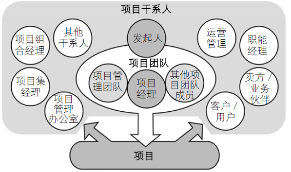

##项目管理过程

### 1、项目启动

启动过程组包含`获得授权`，定义一个新项目或现有项目的一个新阶段，正式开始该项目或阶段的一组过程。通过启动过程，定义初步范围和落实初步财务资源，识别那些将相互作用并影响项目总体结果的`内外部干系人`，`选定项目经理`（如果尚未安排）。这些信息应反映在`项目章程`和`干系人登记册`中。一旦项目章程获得批准，项目也就得到了正式授权。

**项目整合管理** 

- 项目章程
  - 项目章程是正式批准项目成立的文件，并记录能反映干系人期望的初步要求过程；
  - 一旦项目章程获得批准，也就得到了正式授权并指定项目经理；
  - 一般包含：项目说明、目前情况及组织形式、可借鉴资源、可预知的风险、资源配备情况等
  - 一句话：`诞生项目，并为项目经理正名`

**项目沟通管理** 

- 项目干系手册
  - 干系人是指积极参与项目，或其利益可能受项目实施或完成的积极或消极影响的个人和组织；
  - 识别干系人是一个持续的过程，可能有一定的难度。但识别干系人并理解他们对项目的影响力，这是至关重要的；
  - 由于干系人的期望差别很大，甚至相互冲突，所以项目经理的一个重要职责就是要平衡干系人的不同利益。
  - `一句话：搞清楚谁与项目相关`

### 2、项目规划

规划过程组包含明确项目总范围，定义和优化目标，以及为实现上述目标而制定行动方案的一组过程。

**项目时间管理** 

- 定义活动
  - 定义活动是识别为完成项目可交付成果而需采取的具体行动的过程。
  - `一句话：把工作包分解到可估算可管理的程度`
- 排列活动顺序
  - 排列活动顺序是识别和记录项目活动间逻辑关系的过程。
  - `一句话：确定工作执行的先后顺序`
- 估算活动资源
  - 估算活动资源是估算各项活动所需材料、人员、设备和用品的种类和数量的过程。
  - `一句话：确定到底需要什么才能完成工作`
- 估算活动持续时间
  - 估算活动持续时间是根据资源估算的结果，估算完成单项活动所需工作时段数的过程。
  - `一句话：确定完成工作所需经历的时间`
- 制定进度计划
  - 制定进度计划是分析活动顺序、持续时间、资源需求和进度约束并编制项目进度计划的过程。
  - `一句话：描绘出整个项目的实施进程`

**项目成本管理**

- 估算成本
  - 估算成本是对完成项目活动所需资金进行近似估算的过程。
  - `一句话：确定完成工作所需要付出的代价`
- 制定预算
  - 制定预算是汇总所有单个活动或工作包的估算成本，建立一个经批准的成本基准的过程。
  - `一句话：批准完成工作所需要付出的代价`

**项目质量管理**

- 规划质量
  - 规划质量是识别项目及其产品的质量要求或标准，并书面描述项目将如何达到这些要求或标准的过程。
  - `一句话：确定合格的标准`

**项目人力资源管理** 

- 制定人力资源计划
  - 制定人力资源计划是识别和记录项目角色、职责、所需技能以及报告关系，并编制人员配备管理计划的过程。
  - 一句话：需要什么人，需要多少人

**项目沟通管理** 

- 规划沟通
  - 规划沟通是确定项目干系人的信息需求并定义沟通方法的过程。
  - 一句话：项目干系人需要什么，如何给到他们

**项目风险管理** 

- 规划风险
  - 规划风险管理是定义如何实施项目风险管理活动的过程。
  - 一句话：定义如何对待风险
- 识别风险
  - 识别风险是判断哪些风险可能影响项目并记录其特征的过程。
  - 一句话：风险，你在哪里？
- 实施定性风险分析
  - 实施定性风险分析是评估并综合分析风险的概率和影响，对风险进行优先排序，从而为后续分析或行动提供基础的过程。
  - 一句话：揭开风险的面纱
- 实施定量风险分析
  - 实施定量风险分析是就已识别的风险对项目整体目标的影响进行定量分析的过程。
  - 一句话：揭开风险的真相
- 规划风险应对
  - 规划风险应对是针对项目目标，制定提高机会、降低威胁的方案和措施的过程。	
  - 一句话：如何对付风险

**项目采购管理**

- 规划采购
  - 规划采购是记录项目采购决策，明确采购方法，识别潜在卖方的过程。
  - 一句话：买什么？如何买？

**项目整合管理**

- 制定项目管理计划
  - 对定义、编制、整合和协调所有子计划所必需的行动进行记录的过程。
  - 一句话：编制项目执行的蓝图

### 3、项目执行

执行过程组包含完成项目管理计划中确定的工作以实现项目目标的一组过程。这个过程组不但要协调人员和资源，还要按照项目管理计划整合并实施项目活动。

**项目整合管理**

- 指导与管理项目执行
  - 指导与管理项目执行是为实现项目目标而执行项目管理计划中所确定的工作的过程。
  - 一句话：按图索骥

**项目质量管理**

- 实施质量保证
  - 实施质量保证是审计质量要求和质量控制测量结果，确保采用合理的质量标准和操作定义的过程。
  - 一句话：通过过程保证质量

**项目人力资源管理**

- 组建项目团队
  - 组建项目团队是确认可用人力资源并组建项目所需团队的过程。
  - 一句话：让巧妇能为有米之炊
- 建设项目团队
  - 建设项目团队是提高工作能力、促进团队互动和改善团队氛围，以提高项目绩效的过程。
  - 一句话：激发团队潜能
- 管理项目团队
  - 管理项目团队是跟踪团队成员的表现、提供反馈、解决问题并管理变更，以优化项目绩效的过程。
  - 一句话：大家好才是真的好

**项目沟通管理**

- 发布信息
  - 发布信息是按计划向项目干系人提供有关信息的过程。
  - 一句话：把信息传递给需要的人
- 管理干系人期望
  - 管理干系人期望是为满足干系人的需要而与之沟通和协作，并解决所发生的问题的过程。
  - 一句话：沟通并满足或驳回干系人需求

**项目采购管理**

- 实施采购
  - 实施采购是获取卖方应答，选择卖方，授予合同的过程
  - 一句话：购买要买的东西

### 4、项目监控

监控过程组包含跟踪、审查和调整项目进展与绩效，识别必要的计划变更并启动相应变更的一组过程。这一过程组的关键作用是持续并有规律地观察和测量项目绩效，从而识别与项目管理计划的偏差。

**项目整合管理**

- 监控项目工作
  - 监控项目工作是跟踪、审查和调整项目进展，以实现项目管理计划中确定的绩效目标的过程。项目监督包括报告项目状态，测量项目进展，以及预测项目情况等。需要编制绩效报告，来提供项目各方面的绩效信息，如范围、进度、成本、资源、质量和风险等。这些信息可用作其他过程的输入。
  - 一句话：盯着，不停的盯着
- 实施整体变更控制
  - 实施整体变更控制是审查所有变更请求，批准变更，并管理对可交付成果、组织过程资产、项目文件和项目管理计划的变更的过程。
  - 一句话：让变更可控

**项目范围管理**

- 核实范围
  - 核实范围是正式验收项目已完成的可交付成果的过程。
  - 一句话：让用户接受项目成果
- 控制范围
  - 控制范围是监督项目和产品的范围状态，管理范围基准变更的过程。
  - 一句话：让范围在可控之内

**项目时间管理**

- 控制进度
  - 控制进度是监督项目状态以更新项目进展、管理进度基准变更的过程。
  - 一句话：让进度在可控之内

**项目成本管理**

- 控制成本
  - 控制成本是监督项目状态以更新项目预算、管理成本基准变更的过程。
  - 一句话：让费用在可控之内

**项目质量管理**

- 实施质量控制
  - 实施质量控制是监督并记录执行质量活动的结果，从而评估绩效并建议必要的变更的过程。
  - 一句话：让结果满足合格的标准

**项目沟通管理**

- 报告绩效
  - 报告绩效是收集并发布绩效信息的过程，包括状态报告、进展测量结果和预测情况。
  - 一句话：是骡子是马牵出来溜溜

**项目风险管理**

- 监控风险
  - 监控风险是在整个项目中实施风险应对计划，跟踪已识别风险，监测残余风险，识别新风险，并评估风险过程有效性的过程。
  - 一句话：让风险在可控之内

**项目采购管理**

- 管理采购
  - 管理采购是管理采购关系，监督合同绩效，以及采取必要的变更和纠正措施的过程。
  - 一句话：让本次采购可控

### 5、项目收尾

收尾过程组包含为完结所有项目管理过程组的所有活动，以正式结束项目或阶段或合同责任而实施的一组过程。当这一过程组完成时，就表明为完成某一项目或项目阶段所需的所有过程组的所有过程均已完成，并正式确认项目或项目阶段已经结束。

**项目整合管理**

- 结束项目
  - 结束项目或阶段是完结所有项目管理过程组中的所有活动，以正式结束项目或阶段的过程。
  - 一句话：给项目画一个完美的句号

**项目采购管理**

- 结束采购
  - 结束采购是完结单次项目采购的过程。
  - 一句话：给本次购买画上句号